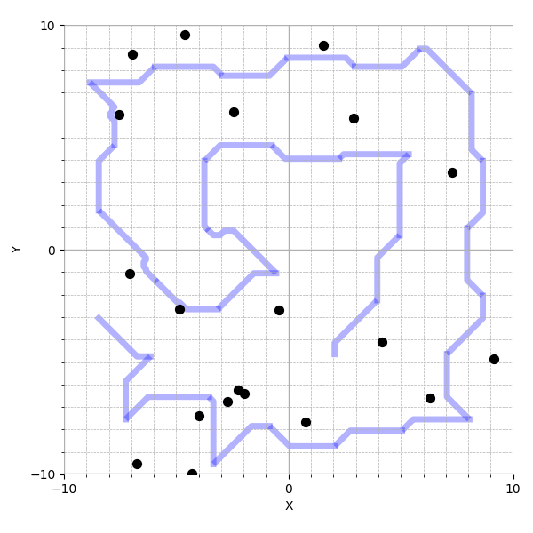
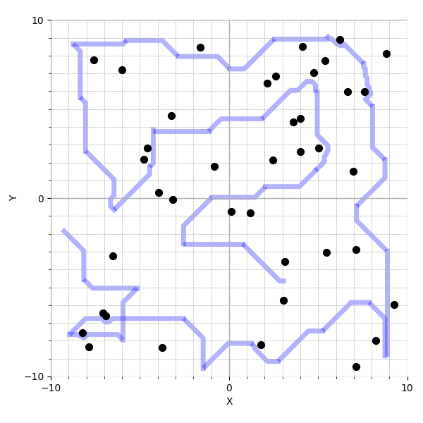
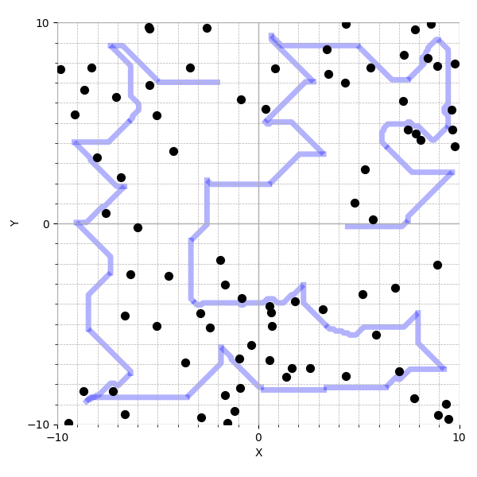
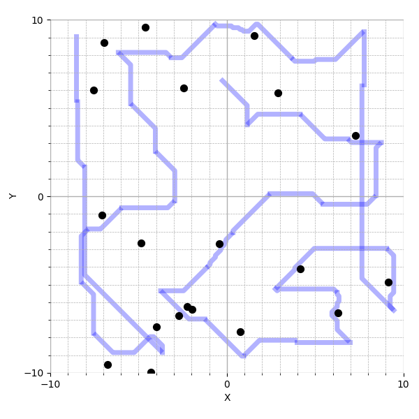
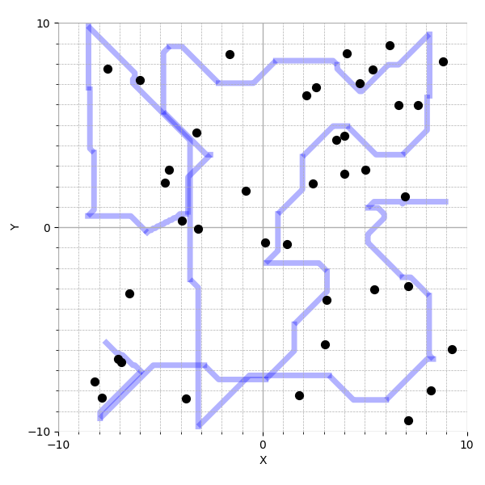
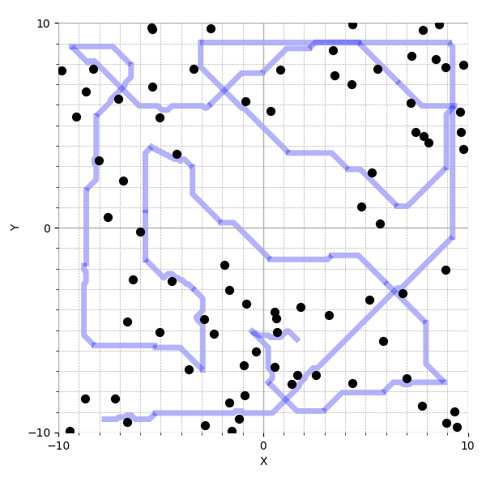

## Learning Efficient Frontier Selection with Cross-Attention Policy

*Code accompanying the CORL 2025 paper “Learning Efficient Frontier Selection with Cross-Attention Policy for Exploring Unstructured Environments.”*

<div align="center">
  <figure style="display:inline-block; margin:1em; text-align:center;">
    
    <figcaption>Ours (Low Density)</figcaption>
  </figure>
  <figure style="display:inline-block; margin:1em; text-align:center;">
    
    <figcaption>Ours (Medium Density)</figcaption>
  </figure>
  <figure style="display:inline-block; margin:1em; text-align:center;">
    
    <figcaption>Ours (High Density)</figcaption>
  </figure>
</div>
<div align="center" style="margin-bottom: 1em;">
  <figure style="display:inline-block; margin:1em; text-align:center;">
    
    <figcaption>Nearest Heuristic (Low Density)</figcaption>
  </figure>
  <figure style="display:inline-block; margin:1em; text-align:center;">
    
    <figcaption>Nearest Heuristic (Medium Density)</figcaption>
  </figure>
  <figure style="display:inline-block; margin:1em; text-align:center;">
    
    <figcaption>Nearest Heuristic (High Density)</figcaption>
  </figure>
</div>


---

### Table of Contents

1. [Prerequisites](#prerequisites)
2. [Environment Setup](#environment-setup)
3. [Building & Launching Docker](#building--launching-docker)
4. [Running Simulations](#running-simulations)
5. [Testing the Learned Policy](#testing-the-learned-policy)
6. [Testing Heuristic Methods](#testing-heuristic-methods)
7. [Script Reference](#script-reference)
8. [License](#license)

---

### Prerequisites

* Ubuntu 22.04 or later
* Docker ≥ 20.10
* NVIDIA drivers & CUDA (if running on GPU)
* `xhost` for display forwarding

---

### Environment Setup

1. **Install NVIDIA Isaac ROS Dev Environment**
   Follow the official guide:
   [https://nvidia-isaac-ros.github.io/getting\_started/dev\_env\_setup.html](https://nvidia-isaac-ros.github.io/getting_started/dev_env_setup.html)

2. **Allow GUI forwarding**

   ```bash
   xhost +local:root
   ```

---

### Building & Launching Docker

All development tools, libraries, and simulation environments run in Docker.

1. **Build the Dev Container**

   ```bash
   cd isaac_ros_common_rl/scripts
   ./run_dev.sh
   ```

2. **Modify isaac_ros_common_rl/docker/compose/docker-compose.yml project path**
    ```bash
    cd isaac_ros_common_rl/docker/compose
    vim docker-compose.yml
    ```
    Change "~/frontier-selection-rl" line for the path where you cloned this project. This line will mount that directory's volume into the /root/frontier-selection-rl folder inside the container.

3. **Compose the Full Stack**

   ```bash
   cd isaac_ros_common_rl/docker/compose
   ./compose.sh
   ```

---

### Running Simulations

Once the Docker container is up:

1. Open a shell in your host machine (or attach to the container).
2. Navigate to the project root folder.
3. Launch the simulation:

   ```bash
   ./launch_as2 -s <world_density>
   ```

   Where `<world_density>` is one of:

   | Option           | Description                      |
   | ---------------- | -------------------------------- |
   | `low_density`    | Sparse obstacle environment      |
   | `medium_density` | Moderately cluttered environment |
   | `high_density`   | Very cluttered environment       |

   This command will spawn a `tmux` session with multiple panes.
   In the **`mission`** pane, you’ll see a prompt ready for your testing commands.

---

### Testing the Learned Policy

From within the `mission` pane:

```bash
python3 rl/test_policy \
    --num_episodes <N> \
    --world_type <world_density>
```

| Parameter        | Type   | Required | Description                                            |
| ---------------- | ------ | :------: | ------------------------------------------------------ |
| `--num_episodes` | int    |    Yes   | Number of episodes to run                              |
| `--world_type`   | string |    Yes   | One of `low_density`, `medium_density`, `high_density` |

**Example**

```bash
python3 rl/test_policy --num_episodes 1 --world_type low_density
```

---

### Testing Heuristic Methods

To compare against classical heuristics:

```bash
python3 rl/environments/as2_gymnasium_env_discrete_heuristics.py \
    --num_episodes <N> \
    --method <heuristic> \
    --plot_path <true|false> \
    --world_type <world_density>
```

| Parameter        | Type   | Required | Description                                                           |
| ---------------- | ------ | :------: | --------------------------------------------------------------------- |
| `--num_episodes` | int    |    Yes   | Number of episodes to run                                             |
| `--method`       | string |    Yes   | Heuristic selection method ( `nearest`, `random`, `hybrid`, `tare`.)          |
| `--plot_path`    | bool   |    No    | `true` to save trajectory plots, `false` otherwise (default: `false`) |
| `--world_type`   | string |    Yes   | One of `low_density`, `medium_density`, `high_density`                |

**Example**

```bash
python3 rl/environments/as2_gymnasium_env_discrete_heuristics.py \
    --num_episodes 1 \
    --method nearest \
    --plot_path true \
    --world_type low_density
```

---

### Script Reference

* **`run_dev.sh`**

  * Launches the ROS/Docker development container.

* **`compose.sh`**

  * Starts all necessary Docker compose services (simulator, ROS bridge, etc.).

* **`launch_as2`**

  * ROS launch wrapper.
  * **Flags:**

    * `-s <world_density>`: select map density (required).

* **`test_policy`**

  * Runs the learned cross-attention policy for a specified number of episodes.

* **`as2_gymnasium_env_discrete_heuristics.py`**

  * Benchmarks classical heuristics in the same environment interface.

---

### License

This project is distributed under the MIT License. See [LICENSE](LICENSE) for details.


